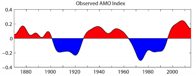

```{r initial, echo=FALSE}
library(ggplot2)
```

```{r setup, include=FALSE}
knitr::opts_chunk$set(echo = TRUE)
```

## Atlantic Hurricanes

We have to analyse the Category 4 and Category 5 Atlantic hurricane data sets and test fit to some reasonable distribution on a per decade bases.

The hurricanes are classified as category 4 and 5 based on the sustained wind speeds. 
Category 4 hurricanes have a wind speed of 209-251km/hr.
Category 5 hurricanes have a wind speed greater then 252km/hr.

## Reading the data

Let us read the 2 data sets in to R. 

```{r hurricanes}
category4<-read.csv("Category 4.csv")
category5<-read.csv("Category 5.csv")

```

## Exploring the Data sets

Let us take a look at the summary of the 2 data sets.

```{r}
summary(category4)
summary(category5)
```


The above code snippets gives a summary of the category4 and category 5 atlantic hurricanes.
From the summary we can find that the months of August and September are prone to Atlantic hurricanes.
About 25% of the hurricanes have occured in the last 20 years.

###Findings

1. There were 120 category 4 hurricanes and 35 category 5 hurricanes.
2. For any given period the category 4 hurricanes are more than category 5 hurricanes

###Insights

The atlantic basin is more prone to category 4 hurricanes

Now let us plot the graph between the maximum sustaied windspeed and pressure of the category 4 hurricanes.
```{r}
## The plot function is used with type 'l' to generate line graphs
plot(category4[,5], type = "l", col = "red",ylim = c(900,975),xlim=c(1,20),yaxt = 'n',ylab = 'Windspeed/Pressure',xlab = ' Hurricane Index',lty = 2)
## The xlab and ylab are arguments that are used to set the labels of the axis
##yaxt is set to n because this plot has two line graphs on differnt scales and the axis values will overlap one over the other
par(new = TRUE) #This enables us to draw two line graphs on the same plot. This can be resetted to the default value by running the dev.off() in console
plot(category4[,4],type = "l", col = "green",ylim = c(200,275),xlim=c(1,20),yaxt = 'n',ylab="",xlab = "",pch=2,lty = 1, main = "Comparison of Windspeed and Pressure")
legend(x="topright",c("windspeed","pressure"),col=c("red","green"),lty = c(1,2),cex = 0.6)#This line is used to add legends to teh plot
```

From the above graph we find that, the windspeed decreses with increase in pressure and vice versa

Now let us try to plot the distribution of hurricanes in decades

In order to do that we need the hurricanes to be grouped in decades. This is done in separate csv files. These csv files are read in to 2 other data frames namely groupedcategory4 and groupedcategory5

```{r}
groupedcategory4<-read.csv("Grouped Category 4.csv")
groupedcategory5<-read.csv("Grouped Category 5.csv")
```

Let us make a bar plot of the distribution of category 4 hurricanes
```{r fig1, fig.height = 8, fig.width = 15}
# This plot is made using the ggplot function. The ggplot is from a library 'ggplo2'. This graph is used since we require the years to be labelled on the xaxis and the number of hurricanes on y axis.
p<-ggplot(data=groupedcategory4, aes(x=groupedcategory4[,1], y=groupedcategory4[,2])) +
        geom_bar(stat="identity")+ggtitle("Category 4 Hurricanes over the years")+labs(y="Number of Hurricanes", x = "Years") + theme(plot.title = element_text(hjust = 0.5))+theme(text = element_text(size=20),
        axis.text.x = element_text(angle=90))
p #Calling p displays the plot
```

The above graph show a cyclic trens that repeats every 40 years but the with an inreasing trend. 

```{r fig2, fig.height = 8, fig.width = 15}
q<-ggplot(data=groupedcategory5, aes(x=groupedcategory5[,1], y=groupedcategory5[,2])) +
        geom_bar(stat="identity")+ggtitle("Category 5 Hurricanes over the years")+labs(y="Number of Hurricanes", x = "Years") + theme(plot.title = element_text(hjust = 0.5))+theme(text = element_text(size=20))
q
```

The category 5 hurricanes seems to be rondom in number over the years. The number of category 5 hurricanes has been the highest during the years 2000-2009.
Also 200-2009 has recorded the most number of Category 4 hurricanes as well.
A total of 23 hurricanes were recorded in the Atlantic basin during the years 2000-2009.
Although there are no category 5 hurricanes during the year 1950-1959, there were 13 category 4 hurricanes recorded during the same period (second highest).
The years 1900-1920 and 1960-1990 seems to be the years of low hurricane activity.

Now let us try to fit a distribution for the total number of hurricanes in the Atlantic basin.

```{r}
myqqplot<-function(x,dist,binom.n=3) ##Defining a function with 3 arguments, x is the data vector, dist is the theoretical distribution which we want to check with and binom.n is used in generating the binomial distribution. binom.n has a default value of 3
{
        n1<-length(x) 
        p1<-c(1:n1)/(n1+1) # this is a probability vector ranging from 0 to 1, with the size equal to that of the data vector.
        if(dist=="pois") ##Generating theoretical quantiles for poisson distribution with the given lambda parameter.
        {
                q<-qpois(p1,mean(x)) #Here lambda is the mean of the input data vector.
        }
        if(dist=="binom") ##Generating theoretical quantiles for binomial distribution with the given n and p values
        {
                q<-qbinom(p1,n1,mean(x/binom.n))
        }
        if(dist=="nbinom") ##Generating theoretical quantiles for negative binomial distribution with the given n and p values
        {
                q<-qnbinom(p1,n1,mean(x/binom.n))
        }
        plot(c(0,sort(x)),c(0,q),xlab="data",ylab="theoretical quantile",main=dist) #The input data is sorted and taken on x axis, the theoretical quantiles are taken on the y axis. We are also plotting the point (0,0) to make the axis look continuous.
}
```

The distribution of hurricanes is not distributted binomially as we cannot find a fixed number of trials.Hence, it is not binomially distributed. So let us check if it is Poisson distributed

```{r}
myqqplot(groupedcategory4[,2],"pois")## Category 4
```

```{r}
myqqplot(groupedcategory5[,2],"pois")## Category 5
```

Ignoring the point (0,0) on both the plots, the number of hurricanes seems to follow poisson distribution.

Here the number of hurricanes is the random variable.

We must note that for a random variable to be poisson distributed, the random variable has to follow the assumpions of Poisson distribution.

Assumptions of Poisson Distribution
1. The probability of observing a single event over a small interval is approximately proportional to the size of that interval.
2. The probability of two events occurring in the same narrow interval is negligible.
3. The probability of an event within a certain interval does not change over different intervals.
4. The probability of an event in one interval is independent of the probability of an event in any other non-overlapping interval.

Let us see if our random variable follows the above assumptions:

The Atlantic Multidecadal Oscillation - a coherent mode of natural variability occurring in the North Atlantic Ocean with an estimated period of 60-80 years. It is based upon the average anomalies of sea surface temperatures (SST) in the North Atlantic basin, typically over 0-80N.[ref - 1]

The AMO is correlated to air temperatures and rainfall over much of the Northern Hemisphere, in particular in the summer climate in North America and Europe. Through changes in atmospheric circulation, the AMO can also modulate spring snowfall over the Alps and glaciers' mass variability. Rainfall patterns are affected in North Eastern Brazilian and African Sahel. It is also associated with changes in the frequency of North American droughts and is reflected in the frequency of severe Atlantic hurricane activity. [ref - 2]

Let us look at the plot of AMO Index


In the above picture we find a cyclic activity of AMO Index. The negative cycle indicates a cool phase and a positive cycle indicates a hot phase.
The AMO index is corelated with the droughts and hurricanes caused in North America.

The cool blue phase of AMO index indicates fewer hurricanes which can be observed from the above distribution of category 4 and category 5 atlantic hurricanes.

So our random variable (number of hurricacnes per decade) does not follow the assumption of poisson distribution - two disjoint time intervals are independent.

Let us try to fit neagtive binomial distribution for our random variable

```{r}
myqqplot(groupedcategory4[,2],"nbinom",binom.n = 17)
myqqplot(groupedcategory5[,2],"nbinom",binom.n = 10)
```

Once again ignoring point(0,0) the distribution looks to be on a straght line. Hence we can say that our random variable follows negative binomial distribution.

To confirm if the random variable follows negative binomial distribution, we ned to do the goodness of fit chisquare test. This is a test which compares the expected value from the theoretical distribution to the observed value from the data.The chisquare value is calculated and its significance is measured using a chisquare distribution. If the p value from the distribution for the given chisquare value is less than critical value then the null hypothesis is rejected and there is a significant deviation from the theoretical distribution.  

Conclusion:

Although our random variable looks to be poisson distributed, but it does not comply with the assumptions of poisson distribution.

We need to explore more on the AMO data and determine wether their is a relationship between the sea surface temperatures and the hurricanes in Atlantic basin.

We also need to do chisquare test to confirm if the data fits the negative binomial distribution

References
1. https://www.forbes.com/sites/marshallshepherd/2019/09/18/current-hurricane-activity-raises-questions-about-the-amowhat-is-it-and-why-is-it-relevant/#2038d553747c
2. https://en.wikipedia.org/wiki/Atlantic_multidecadal_oscillation

Note: This word document is generated using RMarkdown. So kindly ignore the allignment and spacing


